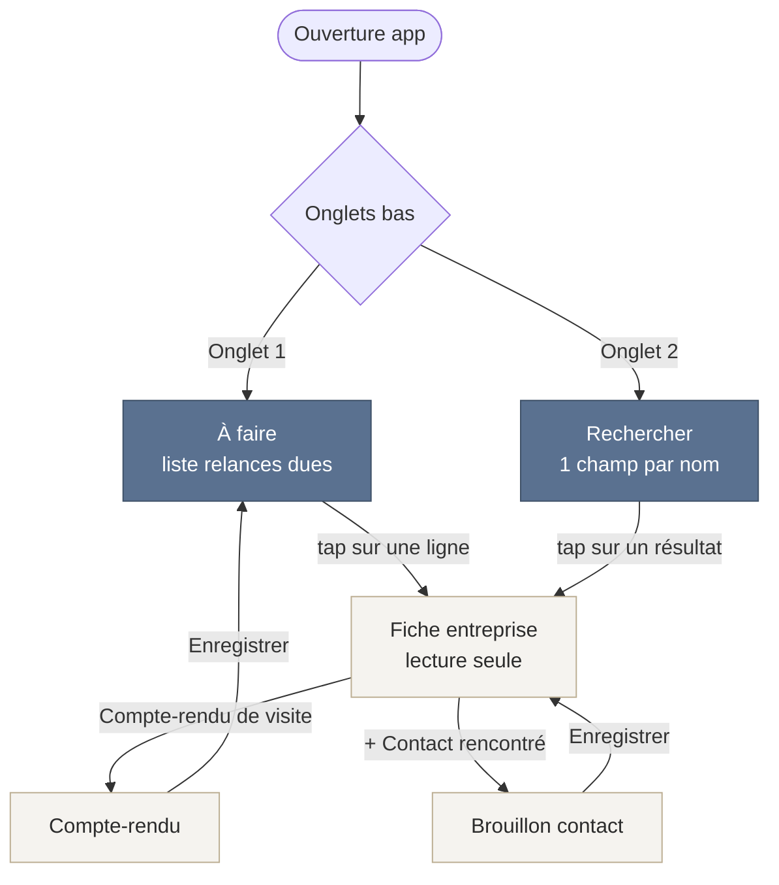
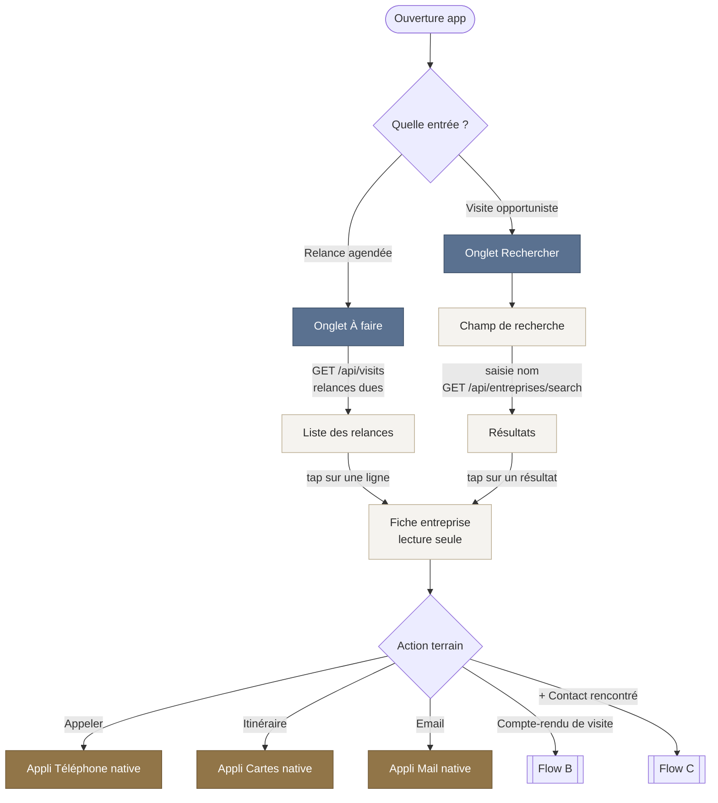
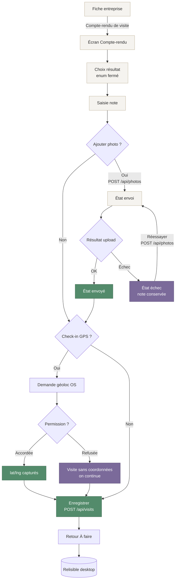
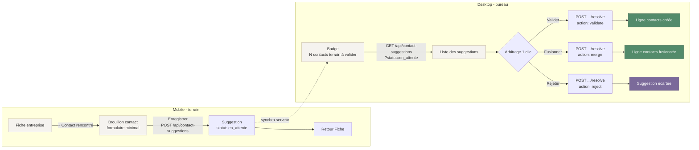

# User flows critiques - CRM FilmPro mobile V3 « outil terrain »

> Périmètre : application mobile V3 « outil terrain ». Tout ce qui n'est pas un usage terrain réel (visite client, chantier) est exclu.
> Boucle produit : **j'arrive -> je sais qui c'est -> je laisse une trace.**
> Navigation : 2 onglets bas - « À faire » (relances dues) et « Rechercher » (par nom). Profondeur de navigation maximale : 2 niveaux.
> Pas de mode offline.

---

## Carte de navigation globale



Niveau 1 = onglets (À faire / Rechercher). Niveau 2 = Fiche entreprise. Compte-rendu et Brouillon contact sont des sous-vues modales de la Fiche (ne comptent pas comme un 3e niveau de navigation : on revient toujours à la Fiche ou à l'onglet d'origine).

---

## Flow A - Consulter une fiche (visite agendée ou non)

**Objectif** : « je sais qui c'est ». Deux entrées possibles vers la même Fiche : par la liste « À faire » (relance agendée) ou par « Rechercher » (visite non agendée, opportuniste).

### Diagramme mermaid



### Endpoints par étape

| Étape | Endpoint | Notes |
|-------|----------|-------|
| Ouverture onglet « À faire » | `GET /api/visits` | Liste des relances dues (résultats `visite_a_relancer`, échéances passées) |
| Saisie dans « Rechercher » | `GET /api/entreprises/search` | Recherche par nom, déclenchée à la frappe |
| Affichage Fiche entreprise | (données entreprise déjà chargées par la liste ou le résultat) | Lecture seule, pas d'appel dédié obligatoire |
| Bouton Appeler / Itinéraire / Email | aucun (handoff OS) | `tel:`, lien cartes natif, `mailto:` - sortent de l'app |

### Variante ASCII des écrans

```
ENTRÉE 1 : par « À faire »            ENTRÉE 2 : par « Rechercher »
+----------------------------+        +----------------------------+
|  À faire                   |        |  Rechercher                |
|                            |        |  +----------------------+  |
|  Relances dues (3)         |        |  | Nom de l'entreprise..|  |
|  ------------------------- |        |  +----------------------+  |
|  > Régie Dupont      hier  |        |                            |
|  > Archi Léman      auj.   |        |  Résultats                 |
|  > FM Genève SA     auj.   |        |  > Régie Dupont            |
|                            |        |  > Régie du Lac SA         |
|                            |        |  > Régie Léman Immo        |
|                            |        |                            |
|  [À faire]  [Rechercher]   |        |  [À faire]  [Rechercher]   |
+----------------------------+        +----------------------------+
              |                                     |
              +------------------+------------------+
                                 v
              FICHE ENTREPRISE (lecture seule)
              +-------------------------------------+
              |  < Retour                           |
              |                                     |
              |  RÉGIE DUPONT                       |
              |  Régie immobilière                  |
              |  Rue du Rhône 12, 1204 Genève       |
              |                                     |
              |  Contact : Marc Dupont              |
              |  +41 22 123 45 67                   |
              |  contact@regie-dupont.ch            |
              |                                     |
              |  Dernière visite : 12.05 (à relancer)|
              |                                     |
              |  +--------+ +-----------+ +-------+  |
              |  | Appeler| | Itinéraire| | Email |  |
              |  +--------+ +-----------+ +-------+  |
              |                                     |
              |  +-------------------------------+  |
              |  |   Compte-rendu de visite      |  |
              |  +-------------------------------+  |
              |                                     |
              |  + Contact rencontré                |
              +-------------------------------------+
```

---

## Flow B - Logger un compte-rendu

**Objectif** : « je laisse une trace ». Depuis la Fiche, j'ouvre le Compte-rendu, je choisis un résultat (liste fermée), j'ajoute une note, des photos (max 10), un check-in GPS optionnel, puis j'enregistre. La trace est relisible côté desktop.

Résultats possibles (enum fermé, jamais d'« Autre ») : `visite_interesse`, `visite_a_relancer`, `absent`, `non_pertinent`.

### Diagramme mermaid (nominal + edge cases)



### Endpoints par étape

| Étape | Endpoint | Notes |
|-------|----------|-------|
| Ajout d'une photo | `POST /api/photos` | 1 appel par photo, max 10. États : envoi -> envoyé / échec |
| Réessayer après échec photo | `POST /api/photos` | Relance le même upload ; la note saisie n'est jamais perdue |
| Enregistrement du compte-rendu | `POST /api/visits` | Corps : `resultat` (enum) + `note` ; `lat`/`lng` ajoutés seulement si GPS accordé |
| Relecture côté desktop | `GET /api/visits` | La visite enregistrée remonte dans l'historique desktop |

### Edge case 1 - géolocalisation refusée

Le check-in GPS est **optionnel**. Si la permission de géoloc est refusée (ou indisponible), on n'envoie pas `lat`/`lng` : la visite est enregistrée **sans coordonnées**. Aucun blocage, aucune relance d'erreur.

### Edge case 2 - échec d'upload photo

Une photo en échec passe à l'état **échec -> réessayer**. La **note reste conservée** (jamais réinitialisée par un échec photo). L'utilisateur peut réessayer la photo autant que nécessaire, ou enregistrer le compte-rendu sans cette photo.

### Variante ASCII des écrans

```
FICHE                          COMPTE-RENDU
+----------------------+       +-------------------------------+
|  RÉGIE DUPONT        |       |  < Annuler      Compte-rendu  |
|  ...                 |       |                               |
|  +----------------+  |  -->  |  Résultat                     |
|  | Compte-rendu   |  |       |  (o) Intéressé                |
|  | de visite      |  |       |  ( ) À relancer               |
|  +----------------+  |       |  ( ) Absent                   |
+----------------------+       |  ( ) Non pertinent            |
                               |                               |
                               |  Note                         |
                               |  +-------------------------+  |
                               |  | Rencontré M. Dupont...  |  |
                               |  +-------------------------+  |
                               |                               |
                               |  Photos (2/10)                |
                               |  [img envoyé] [img envoi...]  |
                               |  [+ Ajouter une photo]        |
                               |                               |
                               |  [ ] Enregistrer ma position  |
                               |                               |
                               |  +-------------------------+  |
                               |  |      Enregistrer        |  |
                               |  +-------------------------+  |
                               +-------------------------------+

ÉTATS PHOTO
+---------------------------------------------+
|  [img]  envoi...        (spinner)           |
|  [img]  envoyé          (coche verte)       |
|  [img]  échec           [ Réessayer ]       |
+---------------------------------------------+
   ^ note toujours conservée pendant les retries

EDGE - GPS REFUSÉ                 EDGE - ÉCHEC UPLOAD
+--------------------------+      +--------------------------+
| Position non autorisée   |      | Photo non envoyée        |
| La visite sera           |      | [ Réessayer ]            |
| enregistrée sans         |      | Votre note est           |
| coordonnées.             |      | conservée.               |
| [ Continuer ]            |      | [ Enregistrer sans ]     |
+--------------------------+      +--------------------------+
```

---

## Flow C - Contact en brouillon -> validation desktop

**Objectif** : capturer sur le terrain un contact rencontré sans polluer la base contacts. Le terrain crée une **suggestion** (`statut: en_attente`). Le desktop l'arbitre en 1 clic (validation / rejet / fusion) ce qui crée ou fusionne une ligne dans `contacts`.

### Diagramme mermaid



### Endpoints par étape

| Étape | Endpoint | Notes |
|-------|----------|-------|
| Enregistrement du brouillon (terrain) | `POST /api/contact-suggestions` | Crée une suggestion `statut: en_attente`, rattachée à l'entreprise de la Fiche |
| Compteur du badge (desktop) | `GET /api/contact-suggestions?statut=en_attente` | Alimente le badge « N contacts terrain à valider » et la liste |
| Validation / fusion / rejet (desktop) | `POST /api/contact-suggestions/[id]/resolve` | Action passée dans le corps ; `validate` crée, `merge` fusionne, `reject` écarte la ligne `contacts` |

### Variante ASCII des écrans

```
MOBILE - terrain
FICHE                          BROUILLON CONTACT
+----------------------+       +-------------------------------+
|  RÉGIE DUPONT        |       |  < Annuler   Contact rencontré|
|  ...                 |       |                               |
|  + Contact rencontré |  -->  |  Nom                          |
+----------------------+       |  +-------------------------+  |
                               |  | Marc Dupont             |  |
                               |  +-------------------------+  |
                               |  Fonction (optionnel)         |
                               |  +-------------------------+  |
                               |  | Gérant                  |  |
                               |  +-------------------------+  |
                               |  Téléphone / Email (optionnel)|
                               |  +-------------------------+  |
                               |  | 022 123 45 67           |  |
                               |  +-------------------------+  |
                               |                               |
                               |  +-------------------------+  |
                               |  |      Enregistrer        |  |
                               |  +-------------------------+  |
                               +-------------------------------+
                                          |
                                          v
                               Suggestion (statut: en_attente)

DESKTOP - bureau
+------------------------------------------------------------+
|  CRM FilmPro                  [ 3 contacts terrain à valider]|
+------------------------------------------------------------+
|  Contacts terrain à valider                                |
|  --------------------------------------------------------- |
|  Marc Dupont - Gérant - Régie Dupont                       |
|     022 123 45 67     [Valider] [Fusionner] [Rejeter]      |
|  --------------------------------------------------------- |
|  Sophie Léman - Régie du Lac SA                            |
|     (rapprochée d'un contact existant ?)                   |
|                       [Valider] [Fusionner] [Rejeter]      |
+------------------------------------------------------------+
        |              |              |
     Valider        Fusionner       Rejeter
        v              v              v
  ligne contacts   ligne contacts  suggestion
     créée           fusionnée       écartée
```

---

## Synthèse endpoints (tous flows)

| Endpoint | Méthode | Flow | Rôle |
|----------|---------|------|------|
| `/api/visits` | GET | A, B | Relances dues (À faire) + relecture historique desktop |
| `/api/visits` | POST | B | Enregistre un compte-rendu (`resultat` + `note`, `lat`/`lng` optionnels) |
| `/api/photos` | GET | B | Récupère les photos d'une visite |
| `/api/photos` | POST | B | Upload d'une photo (états envoi / envoyé / échec -> réessayer) |
| `/api/entreprises/search` | GET | A | Recherche entreprise par nom (onglet Rechercher) |
| `/api/contact-suggestions` | POST | C | Crée un brouillon de contact (`statut: en_attente`) |
| `/api/contact-suggestions?statut=en_attente` | GET | C | Alimente le badge + la liste de validation desktop |
| `/api/contact-suggestions/[id]/resolve` | POST | C | Validation / fusion / rejet 1 clic (crée ou fusionne une ligne `contacts`) |

## Invariants de conception

- Profondeur de navigation max 2 (onglet -> Fiche). Compte-rendu et Brouillon sont des sous-vues de la Fiche.
- Résultat de visite = enum fermé, jamais d'option « Autre » (règle UX projet).
- GPS toujours optionnel : refus = visite sans coordonnées, jamais bloquant.
- Échec photo n'efface jamais la note.
- Pas d'offline : toute action terrain suppose une connexion ; un échec réseau se traduit par un état échec -> réessayer (photos) ou un échec d'enregistrement à retenter.
- Le terrain ne crée jamais directement une ligne `contacts` : il crée une suggestion, le desktop arbitre.
